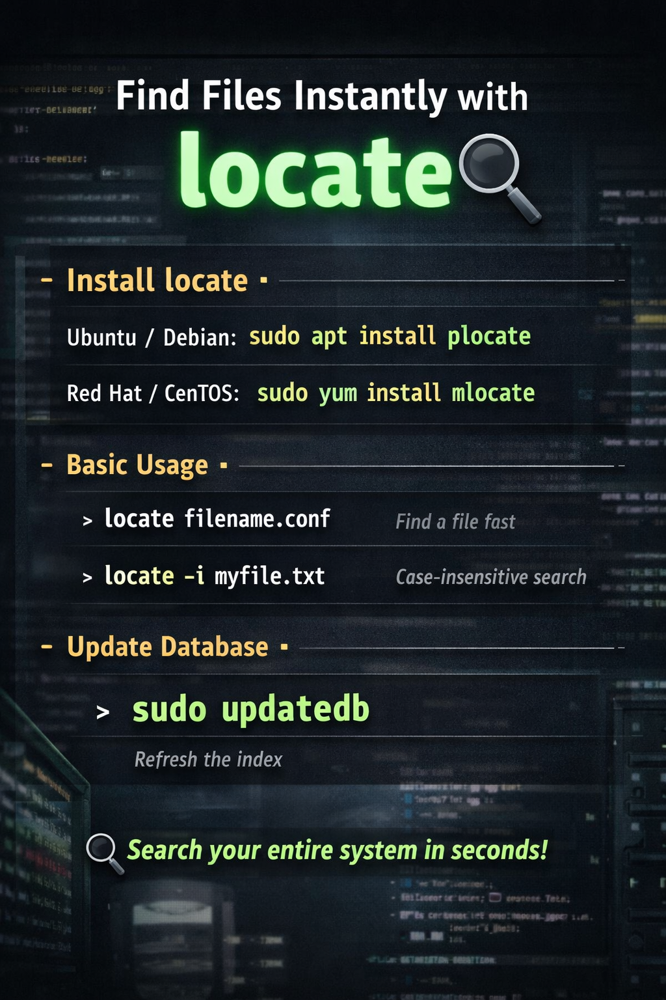

# Speed up your file search in Linux using plocate

Yesterday I wanted to restore some of my configuration backups for my Linux
machine and found just a small problem **I did not remember where i had stored my
files 🙂**

But fortunately I remembered a fantastic tool named **plocate** which it can find
the location of your files very quickly because it uses an **indexed database of
all your files metadata**

- - -
- All you need to remember your file name that you want to know it,s location
  and Done !

Luckily all my backups files followed a standard name format like 😁😁😁

```bash
filename-backup-YYYY-MM-DD
```
## How to use plocate for the first time:

- Install plocate:

```bash
sudo apt update
sudo apt install plocate
```
- Update the database (necessary the first time you use it):

```bash
sudo updatedb
```
- Search for your file:

```bash
plocate filename
```
or you can just write locate

```bash
locate filename
```
and that,s it



