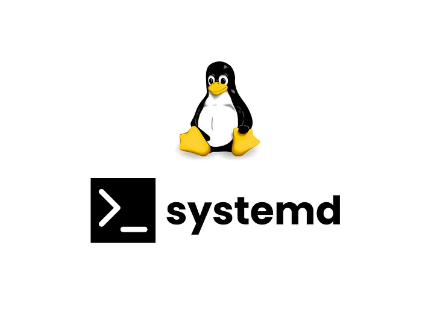
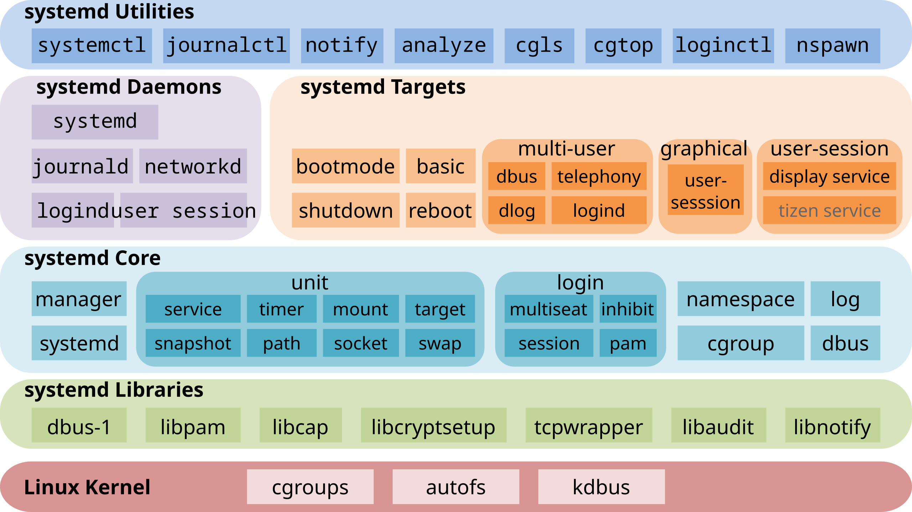

# Why I Chose systemd for Deploying My Java Backend ?

When I want to move from local deployment to real production environment to 
deploy my backend , I have noticed that i need some new requirement like :

- The backend should start automatically when the VPS boots
- And at the same time i should have a very good logging system

✅ so that's why i decided to use **systemd**.

- - -
## So what is systemd ?

systemd is a software suite for system and service management on Linux built to
unify service configuration and behavior across Linux distributions. Its main
component is an init system used to bootstrap user space and manage user
processes.



### 🌟 Ok in simple words and away from wikipedia  definition ^_^ :

- It manage system services in many of modrean Linux distributions like Debian
  , Ubuntu , Fedora and others
- It controls startup , restart and shutdown of the services
- It logging all the output that comes from the services

## Why did I use systemd?

Well , when deploying a backend our job will not end here ,  In real  word
systems we need to have :

- Automatic service startup after reboot , **Why**? Well imagine you need to
  perform some maintenance on your VPS and during it you restart the server 
  then your backend will be shutdown and you need to run it again manually :(

✅ With systemd you just create a service and at the moment the server is boot
again your API will back online again

- - -
- Process logging and monitoring , **why** ? Imagine your user reports that his
  booking failed ,  but your application did not  throw explicit error in the
  fronted ,so how you can investigate this problem ? You need to review the
  service logs !

✅ And here systemd has an amazing tool called  "𝗷𝗼𝘂𝗿𝗻𝗮𝗹𝗰𝘁𝗹" ,which
capture and log every string your app prints to the console and you can see the
logs easily using this command

```bash
journalctl -u my-app.service
```
and you can easily check if your service is running correctly by using this
command

```bash
systemctl status my-app.service
```
## How I used systemd with Spring Boot?

Instead of running my backend like this :

```bash
java -jar backend.jar
```
I created a systemd **service file** (a small configuration file in
/etc/systemd/system/service-name.service) for my spring boot application for
example

```bash
[𝗨𝗻𝗶𝘁]
Description=gojo
After=syslog.target network.target

[𝗦𝗲𝗿𝘃𝗶𝗰𝗲]
User=appuser
Group=appuser
WorkingDirectory=/var/gojo

ExecStart=/usr/bin/java -Xms128m -Xmx1200m -jar  /var/gojo/gojo.jar
ExecStop=/bin/kill -15 $MAINPID
SuccessExitStatus=143

[𝗜𝗻𝘀𝘁𝗮𝗹𝗹]
WantedBy=multi-user.target
```
## What does this configuration mean?

```bash
[𝗨𝗻𝗶𝘁] #𝘀𝗲𝗰𝘁𝗶𝗼𝗻
Description=gojo
```
this is a human readable name for the service ( which is shows in **systemctl
status** command)

```bash
After=syslog.target network.target
```
This mean we need our service to start after networking and logging are ready

```bash
[𝗦𝗲𝗿𝘃𝗶𝗰𝗲] #𝘀𝗲𝗰𝘁𝗶𝗼𝗻
User=appuser
Group=appuser
WorkingDirectory=/var/gojo
```
✅ it,s make our service is running under a non root user (appuser) which is
very very important for security reason

```bash
WorkingDirectory=/var/gojo
```
It sets the working directory for our backend

```bash
ExecStart=/usr/bin/java -Xms128m -Xmx1200m -jar /var/gojo/gojo.jar
```
this is the command we used to execute and start our spring boot backend

```bash
ExecStop=/bin/kill -15 $MAINPID
SuccessExitStatus=143
```
It will sends SIGTERM (15) when we stop our service for example when we use
this command **systemctl stop service-name**

- - -
And finally

```bash
[𝗜𝗻𝘀𝘁𝗮𝗹𝗹] #𝘀𝗲𝗰𝘁𝗶𝗼𝗻
WantedBy=multi-user.target
```
Which is allows our service to start automatically during system boot

- - -
🌟 After we setup our service file now we need to tell systemd to scan it's
folders for new or changed files using this command

```bash
systemctl daemon-reload
```
- - -
Then we need to start our service now using this command

```bash
systemctl start service-name
```
- - -
And to enable this service at boot we use

```bash
systemctl enable service-name
```
- - -
And finally to check if our service is running now we can use

```bash
systemctl status service-name
```

